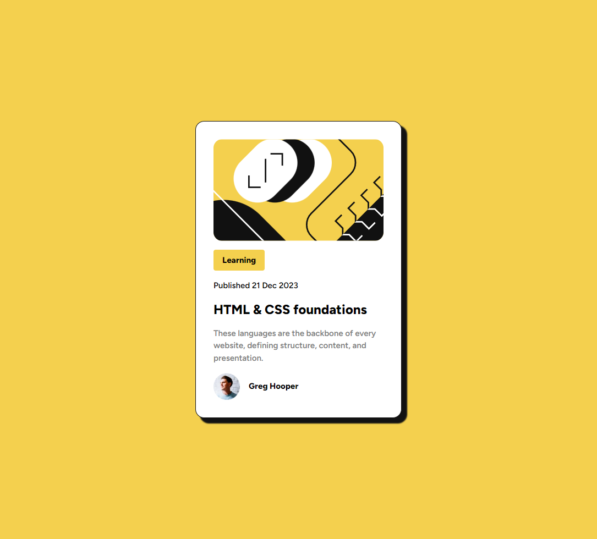
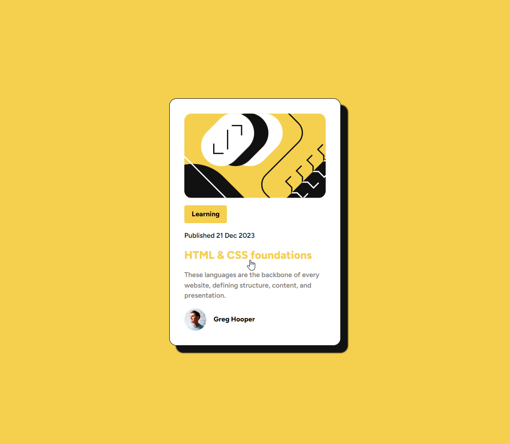
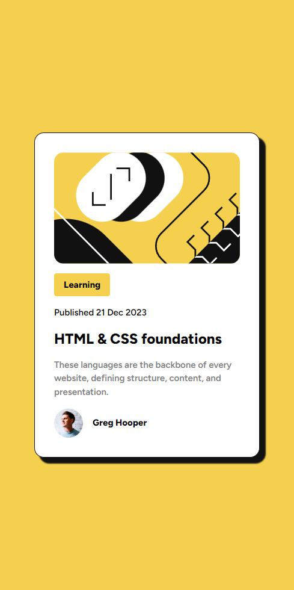

# Frontend Mentor - Blog preview card solution

This is a solution to the [Blog preview card challenge on Frontend Mentor](https://www.frontendmentor.io/challenges/blog-preview-card-ckPaj01IcS). Frontend Mentor challenges help you improve your coding skills by building realistic projects. 

## Table of contents

- [Frontend Mentor - Blog preview card solution](#frontend-mentor---blog-preview-card-solution)
  - [Table of contents](#table-of-contents)
  - [Overview](#overview)
    - [The challenge](#the-challenge)
    - [Screenshot](#screenshot)
    - [Links](#links)
  - [My process](#my-process)
    - [Built with](#built-with)
  - [Author](#author)

## Overview

### The challenge

Users should be able to:

- See hover and focus states for all interactive elements on the page

### Screenshot

### Links

- Solution URL: [here](https://www.frontendmentor.io/solutions/blog-preview-using-atomic-css-by-jabrayilzade-ali-Imw7XhS7l1)
- Live Site URL: [here](https://blog-preview-jabrayilzade-ali.netlify.app/)

## My process

### Built with

- Atomic css
- Semantic HTML5 markup
- CSS custom properties
- Flexbox
- CSS Grid
- Mobile-first workflow

I am getting good add atomic css!!!

## Author

- Frontend Mentor - [Jabrayilzade Ali](https://www.frontendmentor.io/profile/jabrayilzadeali)
- Twitter - [Jabrayilzade Ali](https://twitter.com/JabrayilzadeAli)# blog-preview-card-by-frontendmentor
