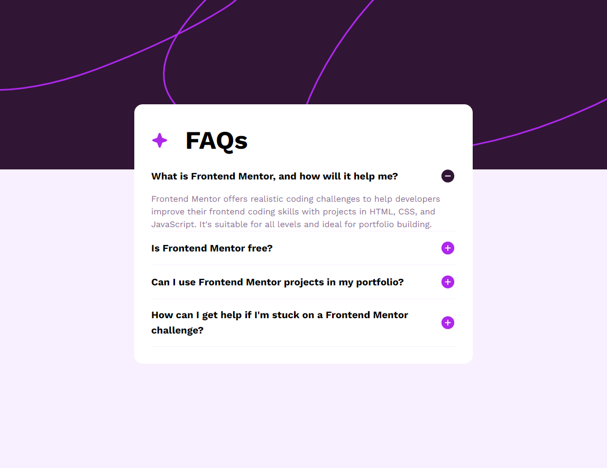
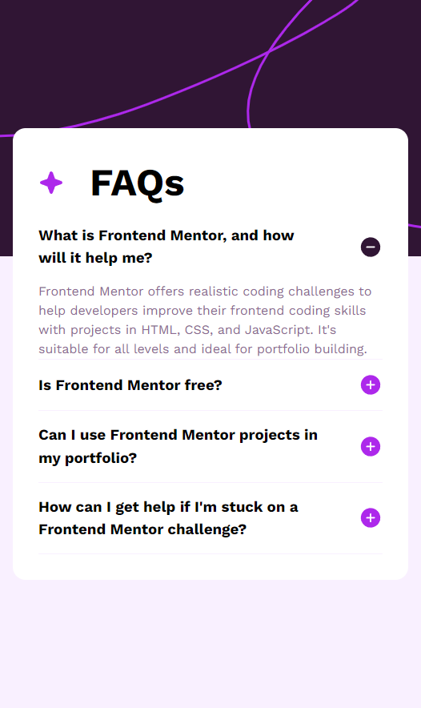

# Frontend Mentor - FAQ accordion solution

This is a solution to the [FAQ accordion challenge on Frontend Mentor](https://www.frontendmentor.io/challenges/faq-accordion-wyfFdeBwBz). Frontend Mentor challenges help you improve your coding skills by building realistic projects. 

## Table of contents

- [Frontend Mentor - FAQ accordion solution](#frontend-mentor---faq-accordion-solution)
  - [Table of contents](#table-of-contents)
  - [Overview](#overview)
    - [The challenge](#the-challenge)
    - [Screenshot](#screenshot)
    - [Links](#links)
  - [My process](#my-process)
    - [Built with](#built-with)
    - [What I learned](#what-i-learned)
  - [Author](#author)

## Overview

### The challenge

Users should be able to:

- Hide/Show the answer to a question when the question is clicked
- Navigate the questions and hide/show answers using keyboard navigation alone
- View the optimal layout for the interface depending on their device's screen size
- See hover and focus states for all interactive elements on the page

### Screenshot

### Links

- Solution URL: [Add solution URL here](https://www.frontendmentor.io/solutions/faq-accordion-using-js-and-css-grid-jjV4QtVA2R)
- Live Site URL: [here](https://faq-accordion-by-frontendmentor.netlify.app/)

## My process

### Built with

- Atomic css
- addEventListener Event Delegation
- Flexbox
- CSS Grid
- Mobile-first workflow

### What I learned

I learned how fast build the app it is first time I built it in one day

## Author

- Frontend Mentor - [Jabrayilzade Ali](https://www.frontendmentor.io/profile/jabrayilzadeali)
- Twitter - [Jabrayilzade Ali](https://twitter.com/JabrayilzadeAli)
