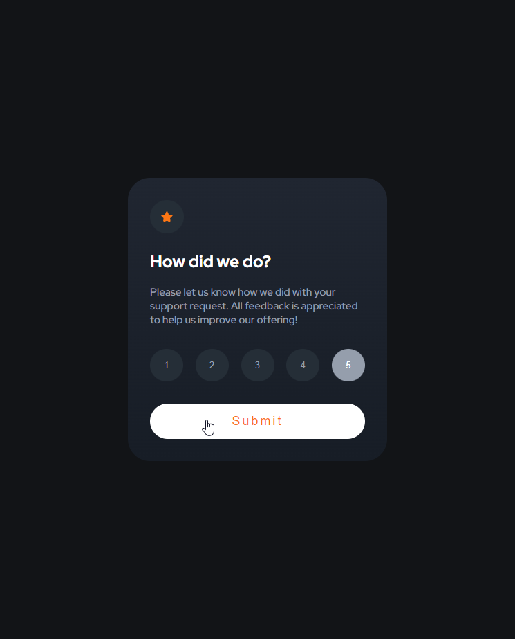
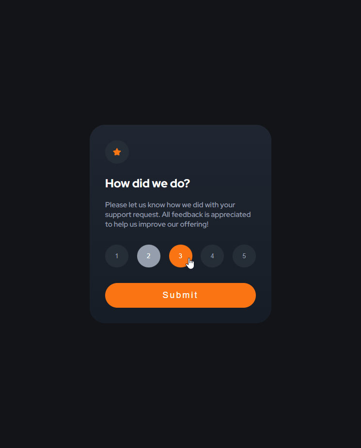
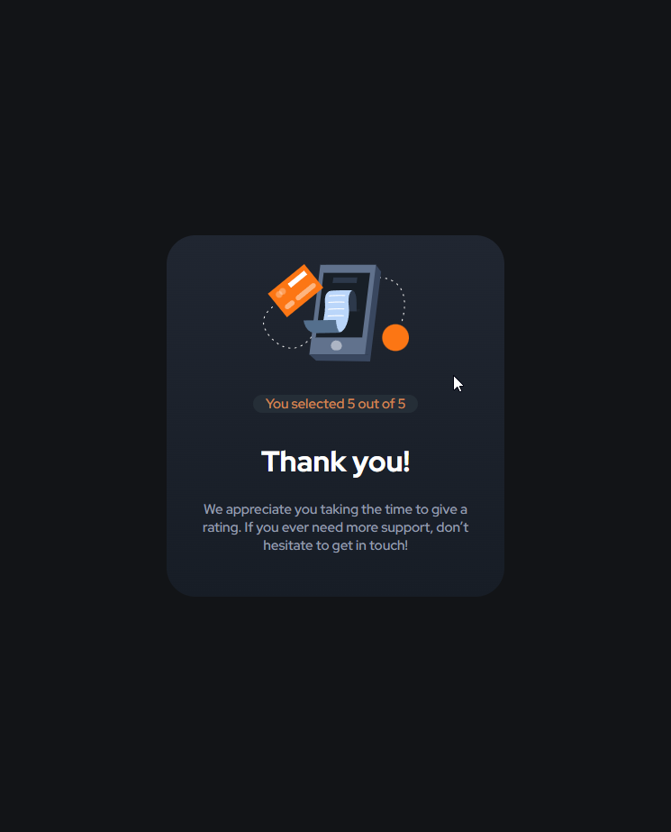

# Frontend Mentor - Interactive rating component solution

This is a solution to the [Interactive rating component challenge on Frontend Mentor](https://www.frontendmentor.io/challenges/interactive-rating-component-koxpeBUmI). Frontend Mentor challenges help you improve your coding skills by building realistic projects. 

## Table of contents

- [Overview](#overview)
  - [The challenge](#the-challenge)
  - [Screenshot](#screenshot)
  - [Links](#links)
- [My process](#my-process)
  - [Built with](#built-with)
  - [What I learned](#what-i-learned)
  - [Useful resources](#useful-resources)
- [Author](#author)


## Overview
- component for user give rating

### The challenge

Users should be able to:

- View the optimal layout for the app depending on their device's screen size
- See hover states for all interactive elements on the page
- Select and submit a number rating
- See the "Thank you" card state after submitting a rating

### Screenshot






### Links

- Live Site: [here](https://jabrayilzadeali.github.io/Interactive-rating-component-by-frontendmentor/)

## My process

### Built with

- Semantic HTML5 markup
- CSS custom properties
- Flexbox
- javascript
- Mobile-first workflow
### What I learned

- how to use !important css property
- media queries

To see how you can add code snippets, see below:

```html
<!DOCTYPE html>
<html lang="en">
<head>
  <meta charset="UTF-8">
  <meta name="viewport" content="width=device-width, initial-scale=1.0"> <!-- displays site properly based on user's device -->

  <link rel="icon" type="image/png" sizes="32x32" href="./images/favicon-32x32.png">
  
  <title>Frontend Mentor | Interactive rating component</title>
	<link rel="stylesheet" href="css/main.css">

	<link rel="preconnect" href="https://fonts.googleapis.com">
	<link rel="preconnect" href="https://fonts.gstatic.com" crossorigin>
	<link href="https://fonts.googleapis.com/css2?family=Overpass:wght@400;700&family=Red+Hat+Display:wght@500;700;900&display=swap" rel="stylesheet">
</head>
<body>

	<form>
		<div class="rating-state">
			<!-- Rating state start -->
			
			<h2>How did we do?</h2>
			<p>
				Please let us know how we did with your support request. All feedback is appreciated 
				to help us improve our offering!
			</p>

			<div class="all-buttons">
				<button data-user-rating="1" class="select-rating">1</button>
				<button data-user-rating="2" class="select-rating">2</button>
				<button data-user-rating="3" class="select-rating">3</button>
				<button data-user-rating="4" class="select-rating">4</button>
				<button data-user-rating="5" class="select-rating">5</button>
			</div>
			<input type="submit" value="Submit">
		<!-- Rating state end -->
		</div>
		<div class="thank-you-state">
			<!-- Thank you state start -->
			

			<p class="rating-text">You selected <span class="rating">5</span><!-- Add rating here --> out of 5</p>

			<h1>Thank you!</h1>

			<p>
				We appreciate you taking the time to give a rating. If you ever need more support, 
				don’t hesitate to get in touch!
			</p>
			<!-- Thank you state end -->
			<script src="js/main.js"></script>

		</div>
	</form>
</body>
</html>
```
```css
:root {
	--Orange: hsl(25, 97%, 53%);
	--White: hsl(0, 0%, 100%);
	--Light-Grey: hsl(217, 12%, 63%);
	--Medium-Grey: hsl(216, 12%, 54%);
	--Light-Dark-Blue: hsl(210, 20%, 18%);
	--Dark-Blue: hsl(213, 19%, 18%);
	--Very-Dark-Blue: hsl(216, 12%, 8%);
}

* {
	box-sizing: border-box;
}

body {
	font-family: 'Overpass', sans-serif;
	font-family: 'Red Hat Display', sans-serif;
	background-color: var(--Very-Dark-Blue);
	height: 100vh;
	margin: 0;
	display: flex;
	justify-content: center;
	align-items: center;
}

form {
	width: 375px;
	padding: 2rem;
	background-image: linear-gradient(to bottom, hsl(219, 21%, 16%), hsl(216, 24%, 12%));
	border-radius: 2rem;
}

h1, h2 {
	color: var(--White);
}


h4 {
	color: var(--Orange)
}

p {
	font-size: 15px;
	color: var(--Light-Grey);
}

button {
	background-color: hsl(210, 19%, 18%);
	color: var(--Light-Grey);
	padding: 1rem;
	width: 3rem;
	border-radius: 100%;
	border: 0;
}

button:hover {
	background-color: var(--Orange) !important;
	color: var(--White) !important;
	cursor: pointer;
}

input {
	background-color: var(--Orange);
	color: var(--White);
	width: 100%;
	padding: 15px;
	font-size: 1.1rem;
	border: 0;
	border-radius: 2rem;
	letter-spacing: .2rem;
}

input:hover {
	background-color: var(--White);
	color: var(--Orange);
	cursor: pointer;
}

.star {
	background-color: hsl(210, 19%, 18%);
	border-radius: 100%;
	padding: 1rem;
}

.all-buttons {
	display: flex;
	justify-content: space-between;
	margin: 2rem 0;
}

.thank-you-state {
	display: none;
	text-align: center;
}

.thank-you-state .rating-text{
	background-color: hsl(210, 19%, 18%);
	color: hsl(25, 56%, 57%);
	border-radius: 2rem;
	margin: 2rem 4rem;
}

@media only screen and (min-width: 768px) {
	form {
		width: 410px;
	}

	form .rating-text{
		margin: 2rem 5rem !important;
	}
}
```
```js
const form = document.querySelector('form');
const buttons = document.querySelectorAll('.select-rating');
const submit = document.querySelector('input');

let userRating;

form.onsubmit = () => false;

buttons.forEach(button => {

	button.onclick = () => {
		console.log('button is clicked')
		clearButtonsBackground()
		button.style.backgroundColor = 'hsl(217, 12%, 63%)';
		button.style.color = '#fff';
		userRating = button.dataset.userRating;
	}
})


function clearButtonsBackground() {
	buttons.forEach(button => {
		button.style.backgroundColor = 'hsl(210, 19%, 18%)';
		button.style.color = 'hsl(217, 12%, 63%)'
		console.log(userRating)
	})
}


submit.onclick = () => {
	let ratingState = document.querySelector('.rating-state');
	let thankYouState = document.querySelector('.thank-you-state');
	let rating = document.querySelector('.rating')
	rating.textContent = userRating;
	if (ratingState.style.display = 'block' && userRating > 0) {
		ratingState.style.display = 'none'
		thankYouState.style.display = 'block'
	} else {
		ratingState.style.display = 'block'
		thankYouState.style.display = 'none'
	}
}
```
### Useful resources

- [w3schools](https://www.your-site.com) - really good for quick reference


## Author

- Github - [jabrayilzadeali](https://github.com/jabrayilzadeali)
- Frontend Mentor - [Jabrayilzade Ali](https://www.frontendmentor.io/profile/jabrayilzadeali)
- Twitter - [Jabrayilzade Ali](https://twitter.com/JabrayilzadeAli)