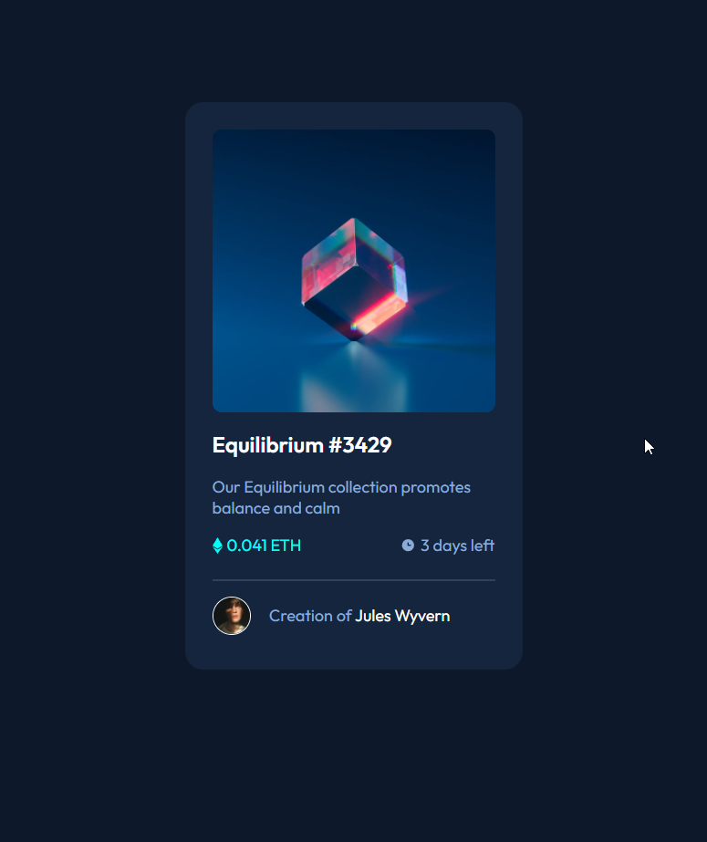
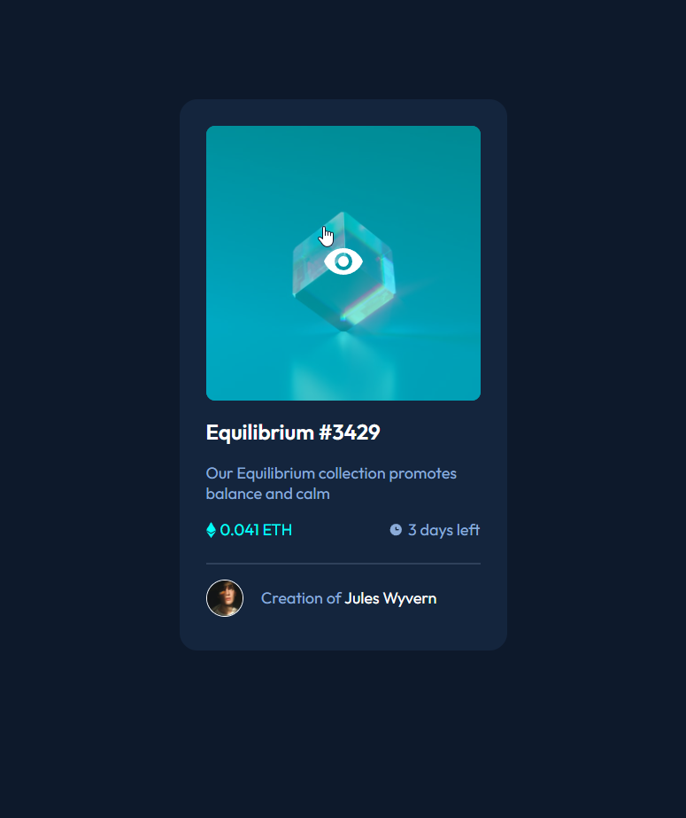

# Frontend Mentor - NFT preview card component solution by Jabrayilzade Ali

This is a solution to the [NFT preview card component challenge on Frontend Mentor](https://www.frontendmentor.io/challenges/nft-preview-card-component-SbdUL_w0U). Frontend Mentor challenges help you improve your coding skills by building realistic projects. 

## Table of contents

- [Overview](#overview)
  - [The challenge](#the-challenge)
  - [Screenshot](#screenshot)
  - [Links](#links)
- [My process](#my-process)
  - [Built with](#built-with)
  - [What I learned](#what-i-learned)
- [Author](#author)
- [Acknowledgments](#acknowledgments)


## Overview

### The challenge

Users should be able to:

- View the optimal layout depending on their device's screen size
- See hover states for interactive elements

### Screenshot



### Links

- Live Site URL: [my solution](https://jabrayilzadeali.github.io/NFT-preview-card-Component-by-frontendmentor/)

## My process

### Built with

- Semantic HTML5 markup
- CSS custom properties
- Flexbox
- Mobile-first workflow


### What I learned

I learned css hover and transion property of css: 
- now I have better grasp of flexbox
- I know about position
- I know about transition


To see how you can add code snippets, see below:

```html
<!DOCTYPE html>
<html lang="en">
<head>
	<meta charset="UTF-8">
	<meta name="viewport" content="width=device-width, initial-scale=1.0"> <!-- displays site properly based on user's device -->

	<link rel="icon" type="image/png" sizes="32x32" href="./images/favicon-32x32.png">
	<link rel="stylesheet" href="css/main.css">

	<link rel="preconnect" href="https://fonts.googleapis.com">
	<link rel="preconnect" href="https://fonts.gstatic.com" crossorigin>
	<link href="https://fonts.googleapis.com/css2?family=Outfit:wght@300;400;600&display=swap" rel="stylesheet">
	
	<title>Frontend Mentor | NFT preview card component</title>

</head>
<body>

	<section class="container">
		<div class="image-container">
			
			<div class="middle">
				<svg width="48" height="48" xmlns="http://www.w3.org/2000/svg"><g fill="none" fill-rule="evenodd"><path d="M0 0h48v48H0z"/><path d="M24 9C14 9 5.46 15.22 2 24c3.46 8.78 12 15 22 15 10.01 0 18.54-6.22 22-15-3.46-8.78-11.99-15-22-15Zm0 25c-5.52 0-10-4.48-10-10s4.48-10 10-10 10 4.48 10 10-4.48 10-10 10Zm0-16c-3.31 0-6 2.69-6 6s2.69 6 6 6 6-2.69 6-6-2.69-6-6-6Z" fill="#FFF" fill-rule="nonzero"/></g></svg>
			</div>
		</div>
		<h1>Equilibrium #3429</h1>
		<p class="info">Our Equilibrium collection promotes balance and calm</p>
		<div class="row">
			<div class="left">
					<svg width="11" height="18" xmlns="http://www.w3.org/2000/svg"><path d="M11 10.216 5.5 18 0 10.216l5.5 3.263 5.5-3.262ZM5.5 0l5.496 9.169L5.5 12.43 0 9.17 5.5 0Z" fill="#00FFF8"/></svg>
					<p>0.041 ETH</p>
			</div>
			<div class="right">
				<svg width="17" height="17" xmlns="http://www.w3.org/2000/svg"><path d="M8.305 2.007a6.667 6.667 0 1 0 0 13.334 6.667 6.667 0 0 0 0-13.334Zm2.667 7.334H8.305a.667.667 0 0 1-.667-.667V6.007a.667.667 0 0 1 1.334 0v2h2a.667.667 0 0 1 0 1.334Z" fill="#8BACD9"/></svg>
				<p>3 days left</p>
			</div>
		</div>
		<hr>
		<div class="row bottom">
			
			<p>Creation of <span>Jules Wyvern</span></p>
		</div>
	</section>

</body>
</html>

```
```css
:root {
	--soft-blue: hsl(215, 51%, 70%);
	--cyan: hsl(178, 100%, 50%);
	--very-dark-blue-main-bg: hsl(217, 54%, 11%);
	--very-dark-blue-card-bg: hsl(216, 50%, 16%);
	--very-dark-blue-line: hsl(215, 32%, 27%);
	--white: hsl(0, 0%, 100%)
}

body {
	background-color: var(--very-dark-blue-main-bg);
	font-family: 'Outfit', sans-serif;
	display: flex;
	justify-content: center;
	align-items: center;
	height: 90vh;
}

h1 {
	color: var(--white);
}

h1:hover {
	color: var(--cyan);
	cursor: pointer;
}

p {
	font-size: 18px;
}


hr {
	border: .1px solid var(--very-dark-blue-line);
}

.container {
	width: 310px;
	padding: 30px;
	border-radius: 20px;
	background-color: var(--very-dark-blue-card-bg);
	color: var(--white);
	color: var(--soft-blue);
}

.image-container {
	position: relative;

}

.equilibrium {
	display: block;
	width: 100%;
	border-radius: 10px;
	background: none;
}

.middle {
	opacity: 0;
	position: absolute;
	top: 50%;
	left: 50%;
	transform: translate(-50%, -50%);
	-ms-transform: translate(-50%, -50%);
}

.image-container:hover {
	background-color: var(--cyan);
	border-radius: 10px;
	cursor: pointer;
}

.image-container:hover .equilibrium {
	opacity: .5;
}

.image-container:hover .middle {
	opacity: 1;
}

.info {
	padding: 0px;
	margin: 0px;
}

.row {
	display: flex;
	justify-content: space-between;
}

.left,
.right {
	display: flex;
	align-items: center;
} 

.left p {
	color: var(--cyan);
}

.left svg {
	padding-right: 5px;
}

.right svg {
	padding-right: 5px;
}

.row.bottom {
	justify-content: start;
	align-items: center;
}

.avatar {
	border: 1px solid var(--white);
	border-radius: 50%;
	object-fit: cover;
	width: 13%;
	margin-right: 20px;
	height: auto;
}

.row span {
	color: var(--white);
}

.row span:hover {
	color: var(--cyan);
	cursor: pointer;
}
```
## Author

- Github - [jabrayilzadeali](https://github.com/jabrayilzadeali)
- Frontend Mentor - [Jabrayilzade Ali](https://www.frontendmentor.io/profile/jabrayilzadeali)
- Twitter - [Jabrayilzade Ali](https://twitter.com/JabrayilzadeAli)

## Acknowledgments

Thanks to [w3scholls](https://www.w3schools.com/default.asp)
