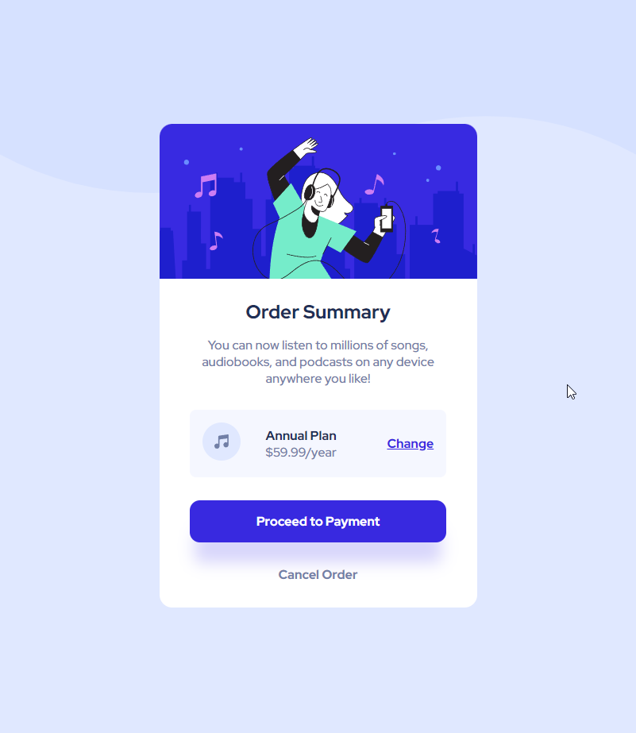
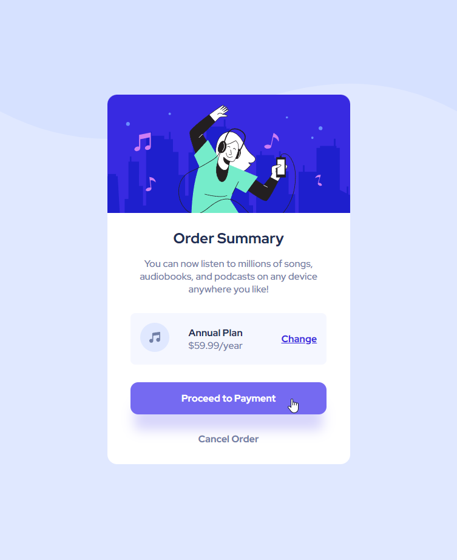
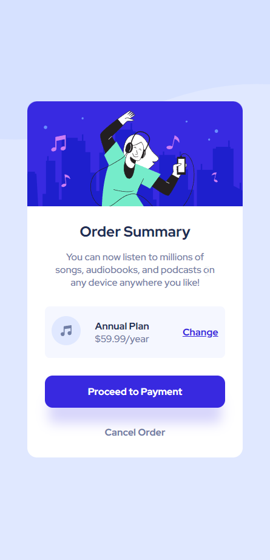

# Frontend Mentor - Order summary card solution

This is a solution to the [Order summary card challenge on Frontend Mentor](https://www.frontendmentor.io/challenges/order-summary-component-QlPmajDUj). Frontend Mentor challenges help you improve your coding skills by building realistic projects. 

## Table of contents

- [Overview](#overview)
  - [The challenge](#the-challenge)
  - [Screenshot](#screenshot)
  - [Links](#links)
- [My process](#my-process)
  - [Built with](#built-with)
  - [What I learned](#what-i-learned)
  - [Useful resources](#useful-resources)
- [Author](#author)
- [Acknowledgments](#acknowledgments)


## Overview
cool order summary componnent by frontend Mentor

### The challenge

Users should be able to:

- See hover states for interactive elements

### Screenshot





### Links

- the repository: [here](https://github.com/jabrayilzadeali/Order-summary-card-component-by-frontendmentor)
- you can visit website: [here](https://jabrayilzadeali.github.io/Order-summary-card-component-by-frontendmentor/)

### Built with

- Semantic HTML5 markup
- media queries
- css backgroudn img
- CSS custom properties
- Flexbox
- Mobile-first workflow


### What I learned

 I learn how to use media queries

To see how you can add code snippets, see below:

```html
<!DOCTYPE html>
<html lang="en">
<head>
	<meta charset="UTF-8">
	<meta name="viewport" content="width=device-width, initial-scale=1.0"> <!-- displays site properly based on user's device -->

	<link rel="icon" type="image/png" sizes="32x32" href="./images/favicon-32x32.png">
	<link rel="stylesheet" href="css/main.css">

	<link rel="preconnect" href="https://fonts.googleapis.com">
	<link rel="preconnect" href="https://fonts.gstatic.com" crossorigin>
	<link href="https://fonts.googleapis.com/css2?family=Red+Hat+Display:wght@500;700;900&display=swap" rel="stylesheet">

	<title>Frontend Mentor | Order summary card</title>
</head>
<body>
	

	<!-- <svg xmlns="http://www.w3.org/2000/svg" width="375" height="194"><path fill="#D6E1FF" fill-rule="evenodd" d="M-131.808 155.366c97.026 51.512 204.233 51.512 321.62 0 117.388-51.512 223.27-51.512 317.648 0V0h-639.268v155.366z"/></svg>
	<svg xmlns="http://www.w3.org/2000/svg" width="1440" height="437"><path fill="#D6E1FF" fill-rule="evenodd" d="M0 349.974c218.558 116.035 460.05 116.035 724.475 0s502.933-116.035 715.525 0V0H0v349.974z"/></svg> -->

	<div class="container">
		<div class="image">
			
		</div>
		<div class="all-texts">
			<div class="main-text">
				<h2>Order Summary</h2>
			</div>
			<div class="info">
				<p>
					You can now listen to millions of songs, audiobooks, and podcasts on any
					device anywhere you like!
				</p>
			</div>
			<div class="flex">
				<div class="music-icon">
					<svg xmlns="http://www.w3.org/2000/svg" width="48" height="48"><g fill="none" fill-rule="evenodd"><circle cx="24" cy="24" r="24" fill="#DFE6FB"/><path fill="#717FA6" fill-rule="nonzero" d="M32.574 15.198a.81.81 0 00-.646-.19L20.581 16.63a.81.81 0 00-.696.803V26.934a3.232 3.232 0 00-1.632-.44A3.257 3.257 0 0015 29.747 3.257 3.257 0 0018.253 33a3.257 3.257 0 003.253-3.253v-8.37l9.726-1.39v5.327a3.232 3.232 0 00-1.631-.441 3.257 3.257 0 00-3.254 3.253 3.257 3.257 0 003.254 3.253 3.257 3.257 0 003.253-3.253V15.81a.81.81 0 00-.28-.613z"/></g></svg>
				</div>
				<div class="price">
					<span class="plan">Annual Plan</span>
					<br>
					<span class="year">$59.99/year</span>
				</div>
				<div class="change">
					<a href="#">Change</a>
				</div>
			</div>
			<div class="payment">
				Proceed to Payment
			</div>
			<div class="cancel">
				Cancel Order
			</div>
		</div>
	</div>

</body>
</html>

```
```css

* {
	box-sizing: border-box;
}


:root {
	--Pale-blue: hsl(225, 100%, 94%);
	--Bright-blue: hsl(245, 75%, 52%);


	--Very-pale-blue: hsl(225, 100%, 98%);
	--Desaturated-blue: hsl(224, 23%, 55%);
	--Dark-blue: hsl(223, 47%, 23%);
	--white: hsl(0, 0%, 100%);
}

body {
	font-family: 'Red Hat Display', sans-serif;
	background-image: url(../images/pattern-background-mobile.svg);
	background-repeat: no-repeat;
	background-size: contain;
	background-color: var(--Pale-blue);
	text-align: center;
	display: flex;
	justify-content: center;
	align-items: center;


	height: 98vh;
}

h2 {
	padding: 0;
	margin-top: 1.3rem;
	margin-bottom: 0.9rem;
	color: var(--Dark-blue)
}

img {
	width: 100%;
	border-top-left-radius: 1rem;
	border-top-right-radius: 1rem;
}

p {
	font-size: 16px;
}

.container {
	width: 355px;
	border-radius: 1rem;
	background-color: var(--white);
}

/* .image ~ div {
	padding: 0 1rem;
} */

.info {
	color: var(--Desaturated-blue);
	margin: 0 2.5rem;
}

.flex {
	display: flex;
	margin: 1.8rem 1.8rem;
	padding: 1rem 0;
	border-radius: .5rem;
	background-color: var(--Very-pale-blue);
	justify-content: space-around;
	align-items: center;
}

circle {
	fill: var(--Pale-blue);
}

.price {
	padding-right: 2rem;
}

.price .plan {
	font-weight: bold;
	color: var(--Dark-blue);
}

.price .year {
	color: var(--Desaturated-blue)
}

.change a{
	color: var(--Bright-blue);
	font-weight: bold;
}

.change a:hover {
	text-decoration: none;
	color: hsl(245, 83%, 68%);
}

.main-text h1{
	font-weight: bold;
}

.payment {
	background-color: var(--Bright-blue);
	color: var(--white);
	font-weight: bold;
	padding: 1rem;
	margin: 0 1.8rem;
	border-radius: .8rem;
	box-shadow: 0 2rem 1.2rem -.4rem hsl(243, 82%, 91%);
}

.payment:hover {
	background-color: hsl(245, 83%, 68%);
	cursor: pointer;
}

.cancel {
	padding: 1.9rem;
	font-weight: bold;
	color: var(--Desaturated-blue)
}

.cancel:hover {
	color: black;
	cursor: pointer;
}

/* At the top level of your code */
@media screen and (min-width: 500px) {
	body {
		background-image: url(../images/pattern-background-desktop.svg);
	}

	.container {
		width: 400px;
	}

	.flex {
		margin: 1.8rem 2.4rem;
	}

	.payment {
		margin: 0 2.4rem;
	}
  }
```


### Useful resources

- [css-sibling-selectors](https://stackoverflow.com/questions/11813465/css-sibling-selectors-select-all-siblings)
- [mdn-box-shadow](https://developer.mozilla.org/en-US/docs/Web/CSS/box-shadow)
- [mdn-scaling-svg-backgrounds](https://developer.mozilla.org/en-US/docs/Web/CSS/Scaling_of_SVG_backgrounds)
- [css-box-shadow-generator](https://html-css-js.com/css/generator/box-shadow/)


## Author

- Github - [jabrayilzadeali](https://github.com/jabrayilzadeali)
- Frontend Mentor - [Jabrayilzade Ali](https://www.frontendmentor.io/profile/jabrayilzadeali)
- Twitter - [Jabrayilzade Ali](https://twitter.com/JabrayilzadeAli)

## Acknowledgments

- thanks to [mdn](https://developer.mozilla.org/en-US/)
- thanks to [frontendMentor](https://www.frontendmentor.io)

