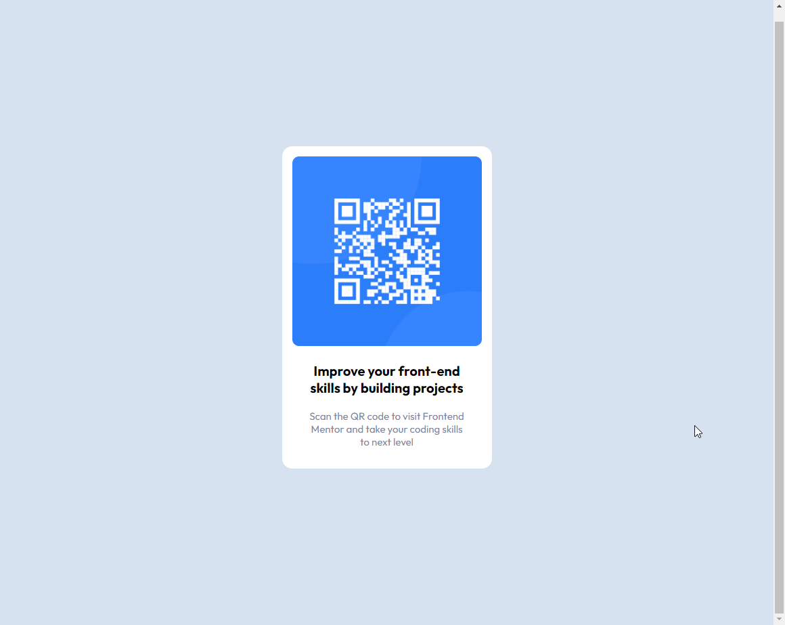
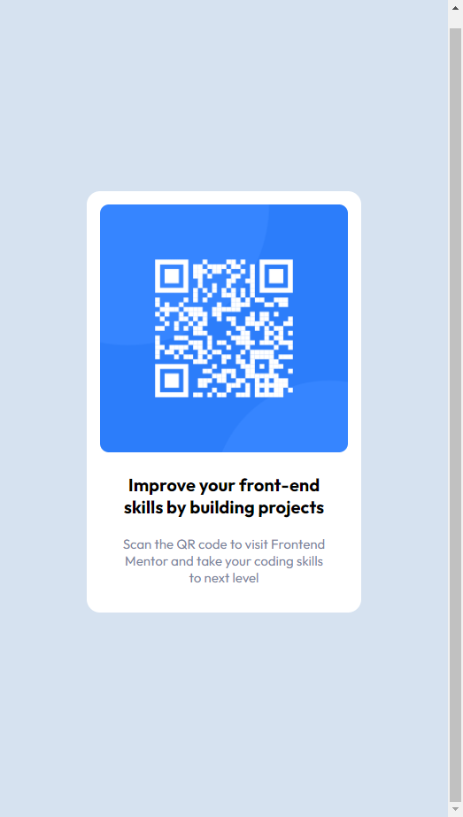

# Frontend Mentor - QR code component solution

This is a solution to the [QR code component challenge on Frontend Mentor](https://www.frontendmentor.io/challenges/qr-code-component-iux_sIO_H). Frontend Mentor challenges help you improve your coding skills by building realistic projects. 

## Table of contents

- [Overview](#overview)
  - [Screenshot](#screenshot)
  - [Links](#links)
- [My process](#my-process)
  - [Built with](#built-with)
  - [What I learned](#what-i-learned)
- [Author](#author)


## Overview
Simple QR component by frontend mentor
### Screenshot





### Links

- Live Site URL: [visit site](https://jabrayilzadeali.github.io/QR-code-Component-by-frontendmentor/)

## My process

### Built with

- Semantic HTML5 markup
- css
- Flexbox
- Mobile-first workflow

### What I learned

Today is the first time for me create a copy of website. I learn how:
- learned about css units(example: vh)
- centering div using flexbox

To see how you can add code snippets, see below:

```html
<!DOCTYPE html>
<html lang="en">
<head>
  <meta charset="UTF-8">
  <meta name="viewport" content="width=device-width, initial-scale=1.0"> <!-- displays site properly based on user's device -->

  <link rel="icon" type="image/png" sizes="32x32" href="./images/favicon-32x32.png">
	<link rel="stylesheet" href="style/style.css">
	 
	<link rel="preconnect" href="https://fonts.googleapis.com">
	<link rel="preconnect" href="https://fonts.gstatic.com" crossorigin>
	<link href="https://fonts.googleapis.com/css2?family=Outfit:wght@400;700&display=swap" rel="stylesheet">
  
  <title>Frontend Mentor | QR code component</title>

</head>
<body>

	<section id="container">
		
		<div class="text">
			<h3 class="bold">Improve your front-end skills by building projects</h3>
			<p>Scan the QR code to visit Frontend Mentor and take your coding skills to next level</p>
		</div>
	</section>

</body>
</html>
```
```css
:root {
	--main-white: hsl(0, 0%, 100%);
	--main-light-gray: hsl(212, 45%, 89%);
	--main-grayish-blue: hsl(220, 15%, 55%);
	--main-dark-blue: hsl(218, 44%, 22%);
}

body {
	font-family: 'Outfit', sans-serif;
	display: flex;
	height: 100vh;
	justify-content: center;
	align-items: center;
	background-color: var(--main-light-gray);
}

#container {
	width: 280px;
	top: 50%;
	margin: auto;
	padding: 15px;
	border-radius: 15px;
	text-align: center;
	background-color: var(--main-white);
}

.bold {
	font-weight: bold;
}

.text {
	padding: 0 20px;
}

img {
	width: 100%;
	border-radius: 10px;
}

p {
	font-size: 15px;
	color: var(--main-grayish-blue);
}

h3 {
	font-size: 20px;
}
```

## Author

- Github - [Jabrayilzade Ali](https://github.com/jabrayilzadeali)