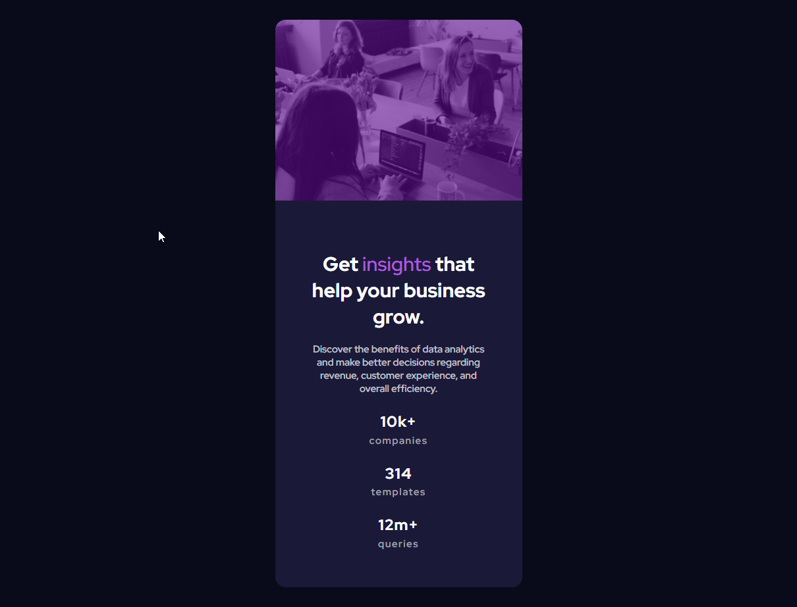
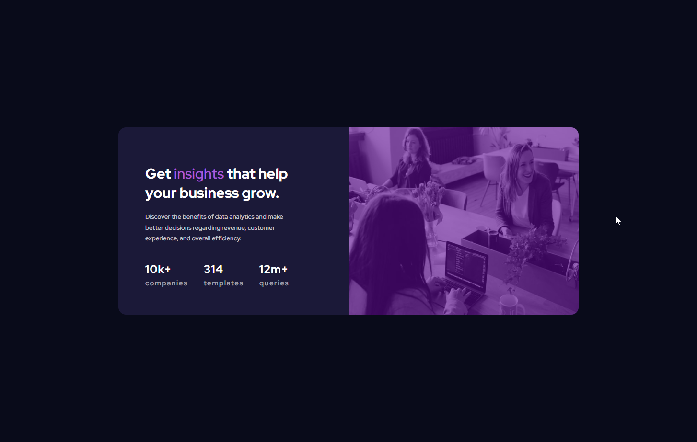

# Frontend Mentor - Stats preview card component solution

This is a solution to the [Stats preview card component challenge on Frontend Mentor](https://www.frontendmentor.io/challenges/stats-preview-card-component-8JqbgoU62). Frontend Mentor challenges help you improve your coding skills by building realistic projects. 

## Table of contents

- [Overview](#overview)
  - [The challenge](#the-challenge)
  - [Screenshot](#screenshot)
  - [Links](#links)
- [My process](#my-process)
  - [Built with](#built-with)
  - [What I learned](#what-i-learned)
- [Author](#author)

**Note: Delete this note and update the table of contents based on what sections you keep.**

## Overview
Front end challenge by frontendmentor

### The challenge

Users should be able to:

- View the optimal layout depending on their device's screen size

### Screenshot





### Links

- Solution URL: [here](https://your-solution-url.com)
- Live Site URL: [here](https://jabrayilzadeali.github.io/Stats-preview-card-component-by-frontendmentor/)

## My process

### Built with

- Semantic HTML5 markup
- CSS custom properties
- Flexbox
- CSS Grid
- Mobile-first workflow


### What I learned

To see how you can add code snippets, see below:
- how to add img color overlay
- css grid

```html
<!DOCTYPE html>
<html lang="en">
<head>
  <meta charset="UTF-8">
  <meta name="viewport" content="width=device-width, initial-scale=1.0"> <!-- displays site properly based on user's device -->

  <link rel="icon" type="image/png" sizes="32x32" href="./images/favicon-32x32.png">
	<link rel="stylesheet" href="style/style.css">

<link rel="preconnect" href="https://fonts.googleapis.com">
<link rel="preconnect" href="https://fonts.gstatic.com" crossorigin>
<link href="https://fonts.googleapis.com/css2?family=Inter:wght@400;700&family=Overpass:wght@400;700&family=Red+Hat+Display:wght@500;700;900&display=swap" rel="stylesheet">
<link rel="preconnect" href="https://fonts.googleapis.com">
<link rel="preconnect" href="https://fonts.gstatic.com" crossorigin>
<link href="https://fonts.googleapis.com/css2?family=Inter:wght@400;700&family=Lexend+Deca&family=Overpass:wght@400;700&family=Red+Hat+Display:wght@500;700;900&display=swap" rel="stylesheet">

  <title>Frontend Mentor | Stats preview card component</title>


  <!-- Feel free to remove these styles or customise in your own stylesheet 👍 -->
</head>
<body>

	<main>
		<div class="img-background item">
			
		</div>
		<div class="content item">
			<h1>Get <span class="insights">insights</span> that help your business grow.</h1>

			<p>
				Discover the benefits of data analytics and 
				make better decisions regarding revenue, 
				customer experience, 
				and overall efficiency.
			</p>

			<div class="score">
				<!-- <h2>10k+ <span class="stat-name">companies</span></h2>
				<h2>314 <span class="stat-name">templates</span></h2>
				<h2>12m+ <span class="stat-name">queries</span></h2> -->
				<div class="stat-name">
					<h2>10k+</h2>
					<span class="stat-name">companies</span>
				</div>
				<div class="stat-name">
					<h2>314</h2>
					<span class="stat-name">templates</span>
				</div>
				<div class="stat-name">
					<h2>12m+</h2>
					<span class="stat-name">queries</span>
				</div>
			</div>
		</div>
	</main>

</body>
</html>
```
```css
:root {
	--Very-dark-blue-main-background: hsl(233, 47%, 7%);
	--Dark-desaturated-blue-card-background: hsl(244, 38%, 16%);
	--Soft-violet-accent: hsl(277, 64%, 61%);
	--White-main-heading-stats: hsl(0, 0%, 100%);
	--Slightly-transparent-white-main-paragraph: hsla(0, 0%, 100%, 0.75);
	--Slightly-transparent-white-stat-headings: hsla(0, 0%, 100%, 0.6);
}

* {
	box-sizing: border-box; 
}

body {
	font-family: 'Inter', sans-serif;
	font-family: 'Lexend Deca', sans-serif;
	font-family: 'Overpass', sans-serif;
	font-family: 'Red Hat Display', sans-serif;

	font-size: 15px;
	background-color: var(--Very-dark-blue-main-background);

	width: auto;
	height: 100vh;
	display: flex;
	justify-content: center;
	align-items: center;
	margin: 0;
}

p {
	color: var(--Slightly-transparent-white-main-paragraph)
}

main {
	background-color: var(--Dark-desaturated-blue-card-background);
	color: var(--White-main-heading-stats);
	width: 375px;
	border-radius: 1rem;
	text-align: center;
}

img {
	width: 100%;
}

.img-background {
	background-color: hsl(276, 89%, 31%);
	height: 275px;
}

img,
.img-background {
	border-radius: 1rem 1rem 0 0;
}

.img {
	opacity: 0.4;
}

.content {
	padding: 3.5rem;
}

.insights {
	color: var(--Soft-violet-accent);
}

.stat-name {
	margin-top: -15px;
	letter-spacing: .1rem;
	color: var(--Slightly-transparent-white-stat-headings);
	display: block;
}

span {
	font-weight: normal;
}

h2 {
	margin-top: 40px;
	color: white;
}

@media (min-width: 1440px) {
	main {
		display: grid;
		grid-template-columns: repeat(2, 1fr);
		/* flex-direction: row-reverse; */
		width: 960px;
		text-align: left;
	}

	.img-background {
		width: 100%;
		height: 100%;
		order: 1;
		/* object-fit: contain; */
	}

	img {
		height: 100%;
	}

	img,
	.img-background {
		border-radius: 0 1rem 1rem 0;
	}


	/* .item {
		flex-basis: 0;
		flex-grow: 1;
	} */

	.content {
		box-sizing: border-box;
		padding-right: 4rem;
	}

	.content p {
		width: 290px;
		font-size: .82rem;
		line-height: 1.4rem;
	}

	.score {
		display: flex;
		width: 300px;
		justify-content: space-between;
	}


	/* .item {
	}

	img {
		max-width: 100%;
	}

	.img-background {
		max-height: 468px;
	} */

	/* .item {
		flex-grow: 1;
		width: 720px;
	}

	.content {
		padding: 3.5rem;
	}

	img {
		width: 100%;
	}

	.img-background {
		height: 100%;
		object-fit: cover;
	}

	.score {
		display: flex;
		justify-content: space-around;
	} */

}
```

## Author

- Frontend Mentor - [Jabrayilzade Ali](https://www.frontendmentor.io/profile/jabrayilzadeali)
- Twitter - [Jabrayilzade Ali](https://twitter.com/JabrayilzadeAli)
